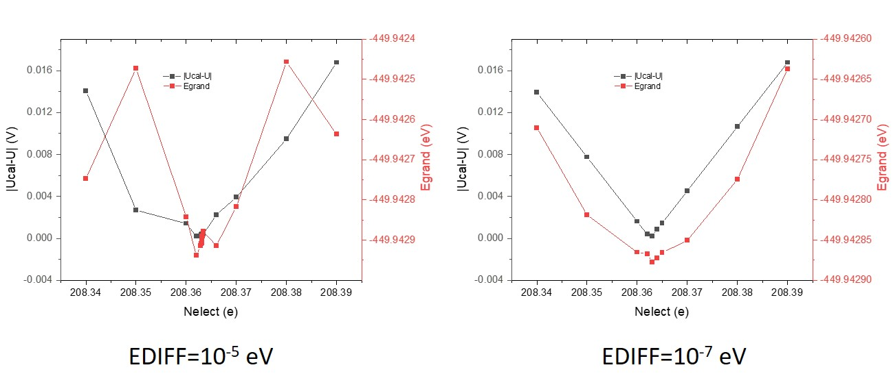

# FCP-vasp-ase
ASE interface for fully converged constant potential (FCP) simulations with the Vienna Ab initio Simulation Package (VASP)

version 2.0

The constant-potential calculator was developed by Zhaoming Xia.

**If you use this code, please cite:** ***https://doi.org/10.1021/acs.jctc.3c00237 *** 
The original paper used the code of version 1.0

## Before you use

1. If you want to run constant-potential calculation properly, the vaspsol code (https://github.com/henniggroup/VASPsol) should be included in the source code directory of VASP before compiling VASP; the patch of vaspsol should be applied to compute the FERMI_SHIFT (installation guidance: https://github.com/henniggroup/VASPsol/blob/master/README.md); add -Dsol_compat option to the list of precompiler options(CPP_OPTIONS) in the makefile of VASP, then compile VASP.

2. Make sure you have installed python and pip.

3. Install ase by 'pip install ase'.

2. Copy FCPelectrochem.py to "ase_installation_path/calculators/".(note:ase_installation_path can be found by running 'ase info')

3. If you want to use PLUMED interface, the python wrap of PLUMED should be installed. Read this page for more information (https://wiki.fysik.dtu.dk/ase/ase/calculators/plumed.html).

## How to use (version 2)

1. The path of the directory containing the pseudopotential directories (potpaw,potpaw_GGA, potpaw_PBE, ...) should be set by the environmental flag $VASP_PP_PATH.

2. A simple example to call the module:

'''

    from ase.calculators.FCPelectrochem import FCP
    from ase.calculators.vasp import Vasp
    from ase.io import read

    cal_sol=Vasp(xc='PBE', #functional
          pp='PBE',            #type of pseudopotential
          kpts=(3, 3, 1),      #kpoint
          ncore=4,
          ispin=2,lasph=True,ismear=0, sigma=0.1, algo='Fast', ediff=1E-5, prec='Accurate',  
          encut=400,  nelm=500 , addgrid='Ture',lreal='Auto',lorbit=11, ldau_luj={'Fe': {'L': 2, 'U': 5.0, 'J': 0.46}}, lmaxmix=4, #parameters for SCF
          tau=0, lrhoion=False, lsol=True, eb_k=78.4, lambda_d_k=3.0, #parameters for vaspsol
          lwave=True, lcharg = False,              #write WAVECAR to speed up the SCF of the next ionic step
          )

    cal_FP=FCP(innercalc=cal_sol,                             #DFT calculator
              fcptxt='log-fcp.txt',                           #log file
              U=0.8,                                          #electrochemical potential vs. SHE
              NELECT = 208.5,                                 #initial guass of number of electrons
              NELECT0=210,                                    #number of electrons at the potential of zero charge
              work_ref=4.6,                                   #the work function of SHE in eV. 
          )      
    
    atoms=read('POSCAR')
    atoms.calc(cal_FP)

'''

3. FCP has some extra parameters:

'''

            innercalc: calculator
                DFT calculator to calculate energy and forces
                defult:Vasp

            U: float
               The potential of working electrode (V vs. reference electrode).
               defult:None
            
            NELECT: float
                initial guass of number of electrons.
                defult:None
            
            NELECT0: float
                number of electrons of the potential of zero charge (PZC). 
                defult:None

            FCPmethod: str
                method to run constant-potential calculation:
                'Newton-fitting'   (recommanded)
                defult:'Newton-fitting'

            FCPconv: float
                 converagence of delta_miu (eV) for constant-potential calculation. 
                 defult:0.01

            work_ref: float
                the work function (the negative value of absolut electrode potential) of reference electrode.
                If the reference electrode is SHE, work_ref is set to the defult value. (4.6)
                If the reference electrode is RHE, you should set the work_ref manually according the pH.
                defult:4.6
       
            C: float
                initial guass of capacitance per surface area. (e/V/(Å^2))
                defult:1/80

            max_FCP_iter: int
                maximum steps for FCP steps.
                defult:1000

            adaptive_lr: bool
                whether to use adaptive_lr to reduce oscillation
                defult: False

            always_adjust: bool
                Adjust Nelect again even when potential is within tolerance. This is useful to set to True along with a loose potential tolerance (FPconv) to allow the potential and structure to be simultaneously optimized in a geometry optimization.
                defult:True
'''

## Other DFT-calculators
This interface only support Vasp calculator. If you want to use other calculator, you should define the read_fermishift() function get_fermi_level()

## For advanced users

The grand energy Egrand is defined as:

Egrand = E + E_Fermi_shift * (Nelect - Nelect0) + (U + work_SHE) * (Nelect - Nelect0)

Note that the averaged electrostatic potential of the periodic cell is zero for DFT, which indicates that the electronic energy is referenced at the averaged electrostatic potential. It has no influence for the system with no net charge (Nelect - Nelect0 = 0). However, the electronic energy should be referenced at vacuum if the net charge in nonzero, since the work function of SHE is referenced at vacuum. Thus, "E_Fermi_shift * (Nelect - Nelect0)" should not be ignored.

If you want to use this code for other DFT-calculators, you must define a function to calculate the E_Fermi_shift. A reasonable approximation for E_Fermi_shift is to calculate the electrostatic potential at the point where there is the lowest electron density.

The way to verify the E_Fermi_shift is to plot the Egrand and |Ucal-U|. If E_Fermi_shift is reasonable, the minimum point for Egrand and |Ucal-U| should be the same.

The accuracy of electronic step is critical for the convergence of FCP. I recommend to use a high an accuracy for DFT calculations unless the electronic step is extremely slow.

For molecular dynamics, one should turn off "always_adjust" and set max_FCP_iter into 1 to disable the converging of electrochemical potential and allow the fluctuation of electrochemical potential.

